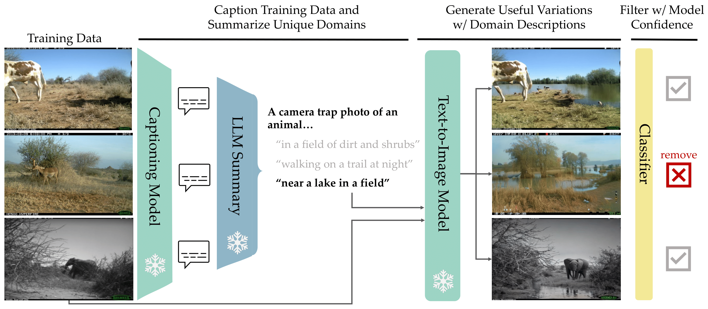

# Automatic Language-guided Image Augmentation (ALIA)



Welcome to the official repository for the paper ["Diversify Your Vision Datasets with Automatic Diffusion-based Augmentation"](https://arxiv.org/abs/2305.16289). If you prefer a condensed version, visit our [TL;DR website](https://lisadunlap.github.io/alia-website/). If you find our work useful, we welcome citations:

```markdown
@article{dunlap2023alia,
  author    = {Dunlap, Lisa and Umino, Alyssa and Zhang, Han and Yang, Jiezhi and Gonzalez, Joseph and Darrell, Trevor},
  title     = {Diversify Your Vision Datasets with Automatic Diffusion-based Augmentation},
  journal   = {arXiv},
  year      = {2023},
}
```

**NOTE:** We are currently in the process of releasing our code. The pipeline for recreating CUB is set up, with more experiments to come. If you encounter any issues, please raise them in our repository.

## Table of Contents
1. [Getting Started](#getting-started)
2. [Prompt Generation](#prompt-generation)
3. [Generating Images](#generating-images)
4. [Filtering](#filtering)
5. [Training](#training)
6. [WandB Projects](#wandb-projects)

## Getting Started

To begin, install our code dependencies using Conda. You may need to adjust the `environment.yaml` file based on your setup:

```bash
conda env create -f environment.yaml
conda activate ALIA
pip install -e .
```

## Prompt Generation

- **Captioning**: We use the BLIP captioning model to caption the entire dataset:
  ```bash
  python caption.py --config configs/Cub2011/base.yaml
  ```
  This will save your captions [here](captions/Cub2011.csv).

- **LLM Summarization**: In our paper, we used GPT-4 to summarize the domains from the captions. Alternatively, we provide [Vicuna](https://chat.lmsys.org/) support for those who prefer not to use OpenAI. Download the Vicuna weights [here](https://github.com/lm-sys/FastChat/tree/main#vicuna-weights) (we used the 13b parameter model).
  ```bash
  pip3 install fastchat
  python huggingface_api.py message="Hi! How are you doing today?"
  python prompt_generation.py --config configs/Cub2011/base.yaml
  ```

## Generating Images

Our editing methods are housed in [editing_methods](./editing_methods) and utilize the Huggingface Diffusers library and the [tyro](https://github.com/brentyi/tyro) CLI.

- **Per Example**: To generate multiple images given a prompt or edit a single image, use [txt2img_example.py](./editing_methods/txt2img_example.py) or [img2img_example.py](./editing_methods/img2img_example.py).
  ```bash
  python editing_methods/txt2img_example.py --prompt "Arachnophobia" --n 20
  ```

- **Per Dataset**: To generate images for an entire dataset, use the `class_names` attribute of the dataset to create per-class prompts.
  ```bash
  python editing_methods/img2img.py --dataset Cub2011 --prompt "a photo of a {} bird on rocks." --n 2
  ```

## Filtering

Once you have generated your data, determine which indices to filter out by running the following command:
```bash
python filtering/filter.py -config configs/Cub2011/alia.yaml
```

## Training

To train the base models or models with augmented data, simply run the appropriate YAML file from the configs folder.
```bash
python main.py --config configs/Cub2011/base.yaml
```
To apply a traditional data augmentation technique, set `data.augmentation=cutmix`. See all available data augmentations in the [load_dataset file](helpers/load_dataset.py).

## WandB Projects

Our datasets of generated data can be found [here](https://wandb.ai/clipinvariance/ALIA) under the 'Artifacts' tab. Each artifact includes the hyperparameters and prompts used to create it.

Download the images with the following command:
```python
import wandb
run = wandb.init()
artifact = run.use_artifact('clipinvariance/ALIA/cub_generic:v0', type='dataset')
artifact_dir = artifact.download()
```

View generated data examples for [Txt2Img](https://wandb.ai/lisadunlap/Text-2-Image), [Img2Img](https://wandb.ai/lisadunlap/Image-2-Image), and [InstructPix2Pix](https://wandb.ai/lisadunlap/InstructPix2Pix).